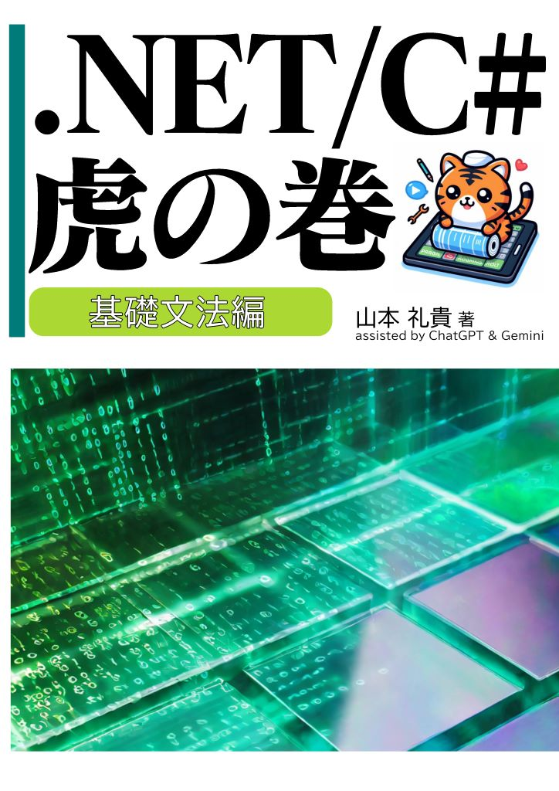

1. [プロジェクトの始め方](./プロジェクトの始め方.md)

1. [コンパクトなコードのすすめ](./コンパクトなコードのすすめ.md)

1. [オブジェクト指向プログラミングのすすめ](./オブジェクト指向プログラミングのすすめ.md)

1. [基礎構文](./基礎構文/README.md)

    1. 基本文法を分析する

        1. [usingの仕組み](./基礎構文/usingの仕組み.md)

        1. [foreachの仕組み](./基礎構文/foreachの仕組み.md)

        1. [yield returnの仕組み](,/基礎構文/yield-returnの仕組み.md)

        1. [async/awaitの仕組み](./基礎構文/async-awaitの仕組み.md)

        1. [await foreachの仕組み](./基礎構文/await-foreachの仕組み.md)

    1. 書き方を選択する

        1. [expression-bodiedを使う](./基礎構文/expression-bodiedを使う.md)

        1. [switch文か switch式か](./基礎構文/switch文かswitch式か.md)

---

著者名：山本礼貴(Yamamoto Reki)

---

本書の執筆に際しては、**ChatGPT** と **Gemini** の技術的支援を受けました。AIの助けを借りることで、内容の精度を高めることができました。